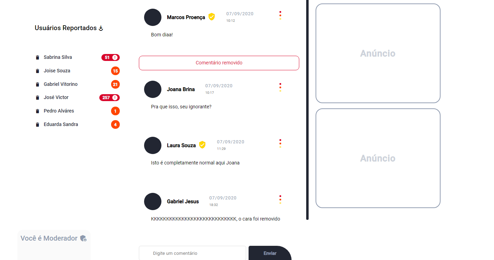

# Project create by Marcos Proença

## Download the dependencies

#### npm install -g @angular/cli

#### ng new project-name

#### ng add @angular/material

#### ng serve -o

## Preview

**Technologies used:**
- _HTML_
- _CSS_
- _Angular material_
- _TypeScript_
- _Git_
- _NPM_

